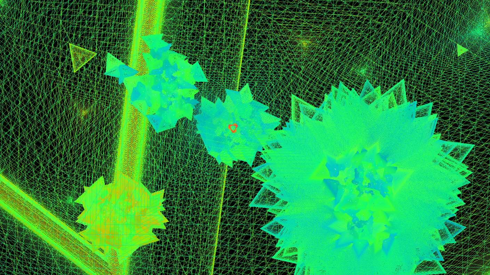

# Crystal Growth Visualizer


A simple visual toy simulating crystal growth by rendering expanding triangles that do not overlap.

## Features

- Visualizes crystal-like structures using growing triangles  
- Prevents overlap during growth for realistic patterns  
- Implemented in C++ using SDL2 for graphics  
- Lightweight and easy to build  

## Requirements

- C++ compiler (g++)  
- SDL2 development libraries  

## Build

Use the provided Makefile to compile the project:

```bash
make
```

This will produce the executable `crystal`.

## Run

Launch the visualizer with:

```bash
./crystal
```

Watch the crystals grow in real-time!

## Controls

- **Left Click:** Place a new crystal starting point at the mouse position. This resets the current crystals and begins fresh growth from that spot.  
- **Middle Click:** Add an additional crystal growth point at the clicked position without resetting existing crystals.  
- **Right Click:** Toggle “autoplace” mode on or off. When enabled, new crystal points will appear automatically at random locations over time.  
- **Scroll Wheel:** Scroll up to add more material and speed up crystal growth; scroll down to slow growth by removing material.  
- **Escape Key:** Press once to activate quit mode (confirmation step). Press again to cancel quitting.  
- **Q Key:** If in quit mode, pressing Q will exit the program immediately.  
- **Any Other Key:** Reset the crystal simulation completely to start fresh.

## Clean

To remove compiled objects and the executable:

```bash
make clean   # removes object files
make fclean  # removes object files and executable
```

## Screenshots

### Crystal Visualization Example



---

Enjoy experimenting with the crystal growth simulation!  
Feel free to modify and extend the code.
